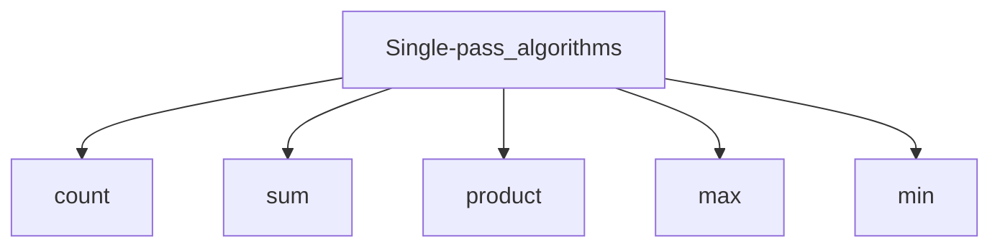

# C++ (алгоритмы и структуры данных)
## Hello, world! на Python и C++

```python
# Python
print("Hello, world!")
```

```Cpp
// C++
#include <iostream>
int main()
{
    // для того чтобы не писать std::, можно прописать в функции "using namespace std;"
    std::cout << "Hello, world!" << std::endl;
    return 0;
}
```
Чтобы вызвать программу на Linux необходимо прописать в терминале `g++ file.cpp` после чего появится исполняемый файл `a.out` который необходимо запустить чтобы увидеть результат выполнения программы `file.cpp` (чтобы не прописывать весь путь до файла в Linux можно написать таким образом `./a.out`)<br>Чтобы увидеть что вернула программа после завершения необходимо прописать `echo $?` (код возврата пребидущей команды). Чтобы поменять исполняемый файл по умолчанию `g++ file.cpp -o name.exe`

## MiniBot на Python и C++
```python
# Python
print("- Hello! What is your name?")
name = input("> ")
print("- I'm glad to see you, ", name, "!", sep="")
print("- What is your age?")
age = int(input("> "))
print("- I thought you are ", age + 1, " year old. You look younger!", sep="")
```
```C++
// C++
#include <iostream>
int main()
{
    using namespace std;
    string name;
    int age;

    cout << "- Hello! What is your name?" << endl << "> ";
    cin >> name;
    cout << "- I'm glad to see you, " << name << "!" << endl
        << "- What is your age?" << endl;
    cin >> age;
    cout << "- I thought you are " << age + 1
        << " year old. You look younger!" << endl;
    return 0;
}
```

## Гернерация последовательности
```python
# Python
for x in range(start, stop, step):
    print(x)
```
```python
# Python
x = start
while x < stop:
    print(x)
    x += step
```
```C++
// C++
#include <iostream>
int main()
{
    using namespace std;
    int start, stop, step;
    x = start;
    while (x < stop)
    {
        cout << x << '\n';
        x += step
    }
    return 0;
}
```
```C++
// C++
#include <iostream>
int main()
{
    using namespace std;
    int start, stop, step;
    for (x = start; x < stop; x += step)
    {
        cout << x << '\n';
    }
    return 0;
}
```
```C++
// C++
#include <iostream>
int main()
{
    using namespace std;
    int N, x;
    cin >> N;
    for (int i = 0; i < N; i++)
    {
        cin >> x;
        if (x == 13 || x == 666)
            continue;
        cout << x * x << '\n';
    }
    return 0;
}
```

## Однопроходные алгоритмы

```C++
// C++
#include <iostream>
int main()
{
    using namespace std;
    int N, x, n, s, p, m;
    n = s = 0; p = 1; m = // min(x) - 1 || flag
    cin >> N;
    for (int i = 0; i < N; i++)
    {
        cin >> x;
        n += 1; s += x; p *= x;
        if (x > m)
        {
            m = x;
        }
        cout << x * x << '\n';
    }
    return 0;
}
```